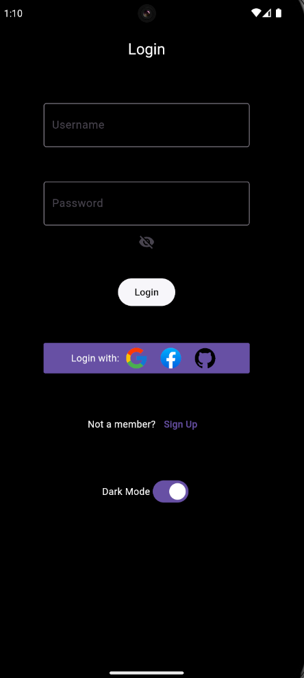
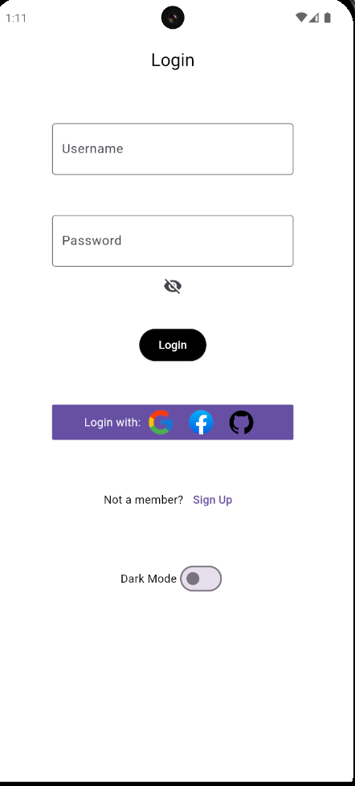
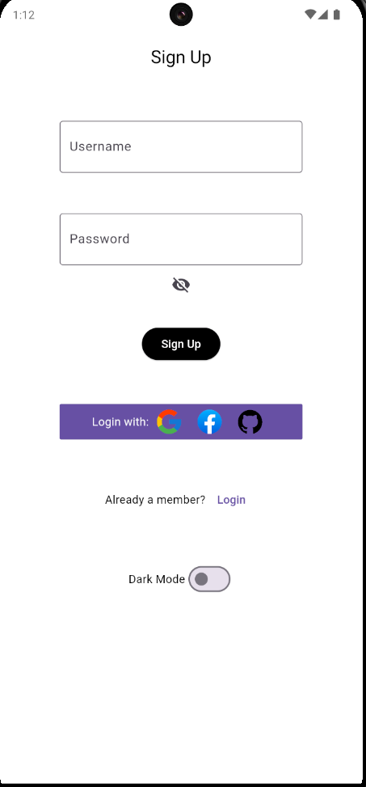

# Flutter Login
A Login app made using Flutter and the [Hive](https://pub.dev/packages/hive) package.

The app uses Hive to store usernames and passwords locally and a switch is added to change between light and dark mode.

## Flutter Project Setup

Follow these steps to set up the Flutter project using the code from this GitHub repository.

## 1. Create a new Flutter project

Open a terminal and run the following commands:

```bash
flutter create your_project_name
cd your_project_name
```

## 2. Replace the contents of the `lib` folder
Replace the contents of the `lib` folder with the contents of the `lib` folder in this github repo

## 3. Replace the `pubspec.yaml` file
Delete the current `pubspec.yaml` file and copy the one from this repo to the root of your project

## 4. Install dependencies

```bash
flutter pub get
```

## 5. Run the app

```bash
flutter run
```

## The end result:




